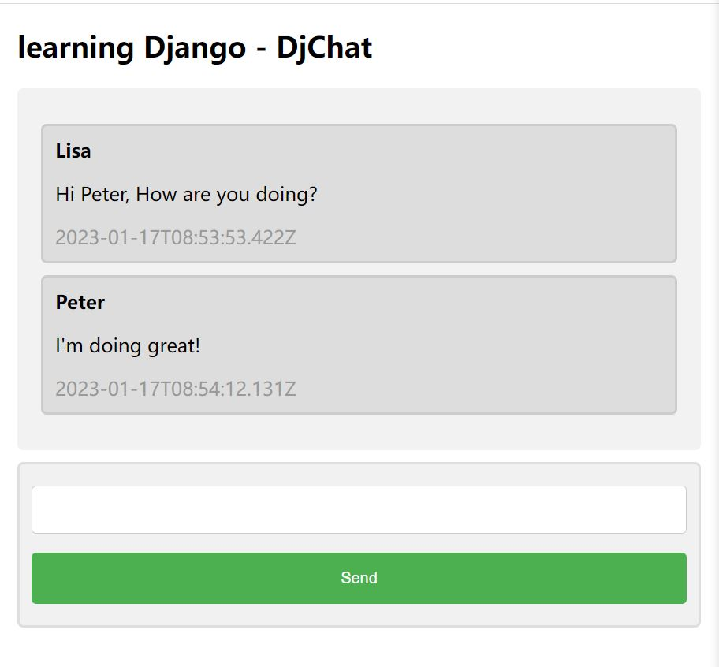

# Real-time-Chat-Application

## Introduction

Real-time Chat App is a mini app coded in Python that users can enter specific chat rooms with usernames and room names.

The backend is implemented with Django and Ajax to handle HTTP connections and requests. SQLite is utilized to store message and room data.

